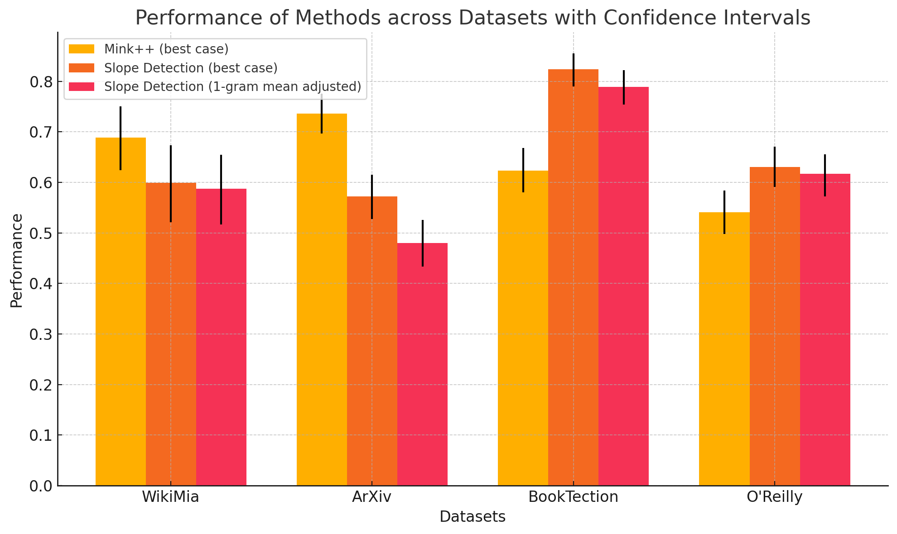

# Detecting Copyright Material in LLM Pre-training Data Using Probability Slopes
***Created as part of the AI Disclosures Project at the Social Science Research Council***

## 1.  Introduction
Large Language Models are trained on a vast corpus of data, much of which is undisclosed. The aim this project was to attempt to further research on how to detect pretraining dataset in order to make LLM training more transparent to copyright holders and guard against companies using data access violations to train LLMs.


## 2. Theoretical Background

When an LLM encounters a sequence it has seen in its training data, its "confidence" or internal probability of predicting the next token should tend to rise as more of the sequence is processed. By analyzing the slope of this increasing confidence, we hypothesize that it is possible to detect when the model is recognizing text it has been trained on.

## 3. Method: Probability Slope Testing on LLM's output
Our **Probability Slope Method** is a novel approach for recognizing when text generated by a Large Language Model (LLM) is included in its training data. The theory is based on the observation that an LLM becomes more confident in its predictions as it processes text it has seen before. By isolating this increase in confidence, we aim to detect when a model recognizes familiar text.

The core of our method the **Probability Slope Method**, is measuring the change in probabilities (or sureness) as the model generates text. However, simply analyzing the probabilities is insufficient, as some tokens are easier to predict regardless of context (e.g., punctuation or common words). To account for this, we employ various normalization techniques.

### 3.1 Fitting a Line to Token Probabilities

To quantify the rise in token prediction confidence over time, we use **Linear Regression** (via `sklearn`'s `LinearRegression` model) to fit a line through the predicted probabilities of each token in the sequence. The coefficient (slope) of this line serves as our main metric, representing the increase in confidence.

### 3.2 Normalization of Probabilities

Some tokens are inherently easier to predict (e.g., periods at the end of sentences). To mitigate the effect of such tokens on the overall slope, we employ several normalization strategies.

#### 3.2.1 N-gram Normalization

We introduce an **N-gram Normalization** technique to remove the influence of particularly predictable tokens. Specifically, for a given token *t*, we subtract the probability of *t* given *n* preceding tokens from the probability of *t* given all preceding tokens. This allows us to adjust for how much of the token's predictability comes from general sentence structure rather than specific sequence context.

#### 3.2.2 Mean and Z-Score Normalization

Another method involves normalizing the slope by applying the **mean** and **z-score** to the token probabilities. After calculating the slope using either raw probabilities or N-gram adjusted probabilities, we compute the mean and standard deviation of the same probabilities. These statistics are then used to normalize the slope, accounting for outliers or irregularities in the data.

### 3.3 Analyzing the Effectiveness of the Method

After normalization, we use the calculated slopes to attempt to separate the in-dataset samples from the out-of-dataset samples. The standard way to do this is by assuming that a subset of data before the model was released was in the dataset, while assuming anything published after the model's training date is out of dataset. Using this aproach we could calculate the **auroc** score of our method, the auroc score is a measure of separability of a dataset using perticular scores.

## 4. Datasets

We run tests on Mamba 1.4b on the following datasets:

-  [ArXivTection:](https://huggingface.co/datasets/avduarte333/arXivTection/viewer?row=0) We use a subset of the ArXivTection dataset. The ArXivTection dataset contains samples of 50 research papers, half published before 2022 (the presumed year the model you are testing is trained) and half after.

-  [BookTection:](https://huggingface.co/datasets/avduarte333/BookTection)  We use a subset of the BookTection dataset. The BookTection dataset contains samples of 50 books, half published before 2022 (the presumed year the model you are testing is trained) and half after.

-   [WikiMia 128 word subset:](https://huggingface.co/datasets/swj0419/WikiMIA/viewer/default/WikiMIA_length128)  A dataset containing 256 snippets of Wikipedia, roughly half published before 2022 and half after.

- O'Reilly Media Book Dataset (privately obtained):  An internal dataset containing snippets from books published by O'Reilly. The tested sample contained 701 books, of which 57% were published after 2022 and 43% were published before 2022. All reprints and new editions were removed. 

## 5. Preliminary Results

Our initial results on the Mamba 1.4b model looked very promising, it beat Min-K%++ on the O'Reilly and BookTection datasets while still underperforming on the ArXiv and WikiMia datasets, however, while we didnt get a chance to extensively test larger models or the DeCop method, it seems like our method performed worse on the Mistral model than the Mamba model in the booktection dataset despite being more than 5 times the size.

### 5.1 results on Mamba 1.4b and comparisons to mink++ method
*All results tested on the [Mamba 1.4b](https://huggingface.co/state-spaces/mamba-1.4b) model, more tests have to be done*

When testing our method on Mamba 1.4b and comparing our findings to the membership inference attack Min-K%++, we found in our preliminary research that our method performs better on some datasets while underperforming on others. This suggests that membership inference attacks may be more dataset-specific than previously thought and that there may be merit in picking different methods for different text types.

<p align="center">
  
</p>

<p align="center" text-align="center">
A graph depicting results for diffrent methods and datasets with confidence intervals on Mamba 1.4b. 
</p>

Specifically, we found that on the BookTection dataset, we outperformed Min-K%++ by a wide margin (roughly 18 points), even when limiting ourselves to just the 1-gram mean-adjusted case. We also observed a smaller but still significant improvement of 9 points with our custom O'Reilly dataset. On the other hand, in the WikiMia 128-word subset and ArXivTection dataset, Min-K%++ significantly outperformed our approach by 9 points and 16 points respectively.

The reasons behind the wide disparity in results may be due to how frequently the tokens in the dataset change and how rare the tokens are overall. For example, the WikiMia dataset contains text from Wikipedia, which is suspected to be included in the training data of most LLMs trained after 2022. However, we do not know how many versions of that text appeared in the model’s dataset, given how frequently Wikipedia is edited. This means that our method may have a harder time detecting the slope due to there being more variations of "correct" answers. There may also be other major differences between the datasets, such as the citation style in the ArXiv dataset. More research is needed to understand why both methods’ performance varies so greatly.

<div align="center">

| Method                           | O'Reilly dataset (Technical books)      | BookTection dataset (fiction)   | WikiMia (Wiki articles, 128 word subset) | ArXiv dataset (academic papers) |
|----------------------------------|-----------------------------------------|--------------------------------|------------------------------------------|---------------------------------|
| Slope Detection (1-gram mean adjusted) | .617 <sub>(.572, .656)</sub>         | .789 <sub>(.754, .822)</sub>   | .588 <sub>(.517, .655)</sub>             | .480 <sub>(.434, .526)</sub>    |
| Slope Detection (best case)       | .631 <sub>(.591, .671)</sub>           | .824 <sub>(.790, .855)</sub>   | .599 <sub>(.521, .674)</sub>             | .572 <sub>(.528, .615)</sub>    |
| Min-K%++ (best case)              | .541 <sub>(.498, .584)</sub>           | .623 <sub>(.580, .668)</sub>   | .689 <sub>(.624, .751)</sub>             | .736 <sub>(.697, .776)</sub>    |

</div>


<p align="center" text-align="center">
auroc scores and confidence intervals for various datasets tested on our method and Min-K%++.
</p>


### 5.2 Results on Mistral 7b and comparisons to the De-Cop Method

We didnt have a chance to fully test the DE-COP method given we initially focused on a small non instruction tuned model however we did run one test on a small subset of the booktection using the mistral model in order to compare our method to thiers at least on a basic level. In our test we found that thier method performed much better for mistral on the booktection dataset. We also found that weirdly the mistral model generated lower auroc scores with our method than the same method did with the much smaller mamba 1.3b model.

<div align="center">

| Method                            | Auroc Score                           | Sample of Dataset       | Dataset    |
|-----------------------------------|---------------------------------------|-------------------------|------------|
| Slope Detection (1-gram mean adjusted) | .668 <sub>(.619, .713)</sub>         | Random 500 item sample  | Booktection|
| Slope Detection (best case)       | .766 <sub>(.723, .809)</sub>          | Random 500 item sample  | Booktection|
| De-Cop                            | .901 <sub>(CI unknown)</sub>          | Full dataset            | Booktection|

</div>

<p align="center" text-align="center">
Early results on the mistral model, the decop auroc score was taken from the decop paper, where it was tested on the full dataset. The tests for our method are on a random 500 item sample.
</p>


Some possible confounding factors include, that we didnt yet get a chance to rerun decop on the subset we used, so its possible (although unlikely to effect to such a significant degree) that the subset of 500 we chose was harder than the dataset as a whole. We will release further tests on Decop and our method as we do them.

### Important Notes on Results
- At this point in testing only one model was extensively (Mamba 1.4b); results may differ on bigger models as indicated with the decop test and more testing needs to be done.
- We didn't yet have a chance to test most methods.

## Apendix: Alternate Methods
### DE-COP
[](https://arxiv.org/pdf/2402.09910)

This attack utilizes the text the models generate instead of the probabilities in order to detect whether a model is trained on data. It quizzes the model between 4 choices (3 of which are paraphrased) to see if the model could consistently choose the correct one. It has been shown to beat most other methods on their dataset; however, it was not tested on Wikipedia like Min-K%++, so there may still be areas where it underperforms. More tests need to be done.

> We propose DE-COP, a method to determine whether a piece of copyrighted content was included in training. DE-COP’s core approach is to probe an LLM with multiple-choice questions, whose options include both verbatim text and their paraphrases. We construct BookTection, a benchmark with excerpts from 165 books published prior and subsequent to a model’s training cutoff, along with their paraphrases. Our experiments show that DE-COP surpasses the prior best method by 9.6% in detection performance (AUC) on models with logits available. Moreover, DE-COP also achieves an average accuracy of 72% for detecting suspect books on fully black-box models where prior methods give approximately 4% accuracy.

### Min-K%++
[](https://arxiv.org/abs/2404.02936)


```math
\text{Min-K\%++}_{\text{token seq.}}(x_{{\lt}t}, x_t) = \frac{\log p(x_t | x_{{\lt}t}) - \mu_{x_{{\lt}t}}}{\sigma_{x_{{\lt}t}}}
```


The Min-K%++ method is a threshold-based approach that relies on identifying a threshold for which scores could be separated into in-dataset and out-of-dataset.

> On the WikiMIA benchmark, Min-K%++ outperforms the runner-up by 6.2% to 10.5% in detection AUROC averaged over five models. On the more challenging MIMIR benchmark, it consistently improves upon reference-free methods while performing on par with reference-based methods that require an extra reference model.

### Neighborhood Comparison
[](https://aclanthology.org/2023.findings-acl.719.pdf)

```math
A_{f_\theta}(x) = \mathbb{1} \left[ \left( \mathcal{L}(f_\theta, x) - \frac{1}{n} \sum_{i=1}^{n} \mathcal{L}(f_\theta, \tilde{x}_i) \right) < \gamma \right]
```

This membership inference attack relies on generating alternate texts for a certain text and assuming that the loss for a model of a text in the model's dataset would be lower than its neighbors. The method then thresholds based on the delta between the mean of loss on a text's neighbors and the text's loss itself.

> We propose and evaluate neighborhood attacks, which compare model scores for a given sample to scores of synthetically generated neighbor texts and therefore eliminate the need for access to the training data distribution. We show that, in addition to being competitive with reference-based attacks that have perfect knowledge about the training data distribution, our attack clearly outperforms existing reference-free attacks as well as reference-based attacks with imperfect knowledge, which demonstrates the need for a reevaluation of the threat model of adversarial attacks.

### Min-K%
[](https://arxiv.org/pdf/2310.16789)

```math
\text{Min-K\% Prob}(x) = \frac{1}{E} \sum_{x_i \in \text{Min-K\%}(x)} \log p(x_i | x_1, \dots, x_{i-1}).

```
This paper takes a threshold-based approach to detecting dataset members. It works by highlighting the k most unlikely tokens in any text.

> We introduce a new detection method Min-K% Prob based on a simple hypothesis: an unseen example is likely to contain a few outlier words with low probabilities under the LLM, while a seen example is less likely to have words with such low probabilities. Min-K% Prob can be applied without any knowledge about the pretraining corpus or any additional training, departing from previous detection methods that require training a reference model on data that is similar to the pretraining data.
