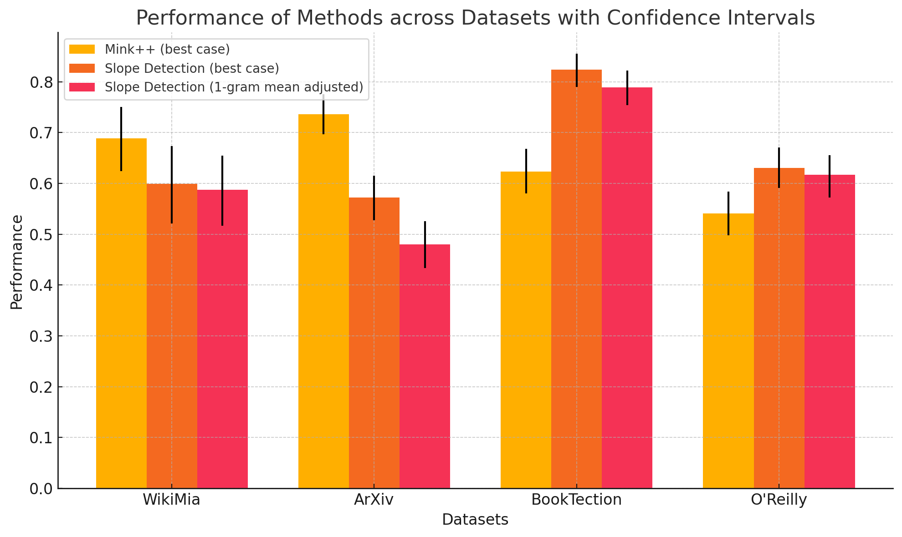
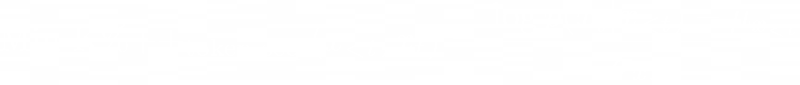
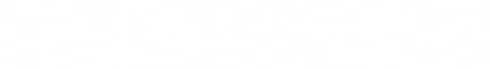
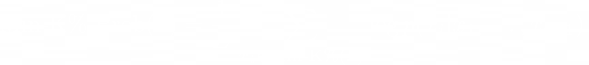

# Probability Slope Method
***Created as part of the AI Disclosures Project at the Social Science Research Council***

## Introduction

The **Probability Slope Method** is a novel approach for recognizing when text generated by a Large Language Model (LLM) is included in its training data. The theory is based on the observation that an LLM becomes more confident in its predictions as it processes text it has seen before. By isolating this increase in confidence, we aim to detect when a model recognizes familiar text.

## Theoretical Background

When an LLM encounters a sequence it has seen in its training data, its "confidence" or internal probability of predicting the next token should tend to rise as more of the sequence is processed. By analyzing the slope of this increasing confidence, we hypothesize that it is possible to detect when the model is recognizing text it has been trained on.

## Methodology

The core of our method is measuring the change in probabilities (or sureness) as the model generates text. However, simply analyzing the probabilities is insufficient, as some tokens are easier to predict regardless of context (e.g., punctuation or common words). To account for this, we employ various normalization techniques.

### 1. Fitting a Line to Token Probabilities

To quantify the rise in token prediction confidence over time, we use **Linear Regression** (via `sklearn`'s `LinearRegression` model) to fit a line through the predicted probabilities of each token in the sequence. The coefficient (slope) of this line serves as our main metric, representing the increase in confidence.

### 2. Normalization of Probabilities

Some tokens are inherently easier to predict (e.g., periods at the end of sentences). To mitigate the effect of such tokens on the overall slope, we employ several normalization strategies.

#### 2.1 N-gram Normalization

We introduce an **N-gram Normalization** technique to remove the influence of particularly predictable tokens. Specifically, for a given token *t*, we subtract the probability of *t* given *n* preceding tokens from the probability of *t* given all preceding tokens. This allows us to adjust for how much of the token's predictability comes from general sentence structure rather than specific sequence context.

#### 2.2 Mean and Z-Score Normalization

Another method involves normalizing the slope by applying the **mean** and **z-score** to the token probabilities. After calculating the slope using either raw probabilities or N-gram adjusted probabilities, we compute the mean and standard deviation of the same probabilities. These statistics are then used to normalize the slope, accounting for outliers or irregularities in the data.

### 3. Analyzing the Slope

After normilization we use the calculated slopes to attempt to seperate the in dataset samples from the out of dataset samples. The standerd way to do this is by assuming that a subset of data before the model was released was in the dataset, while assuming anything published after the models training date is out of dataset.

## Datasets

We ran tests on the model on the folowing datasets:

-  [ArXivTection:](https://huggingface.co/datasets/avduarte333/arXivTection/viewer?row=0)  A dataset containing samples of 50 research papers, half published before 2022 (the presumed year the model you are testing is trained) and half after.

-  [BookTection:](https://huggingface.co/datasets/avduarte333/BookTection)  A dataset containing samples of 50 books, half published before 2022 (the presumed year the model you are testing is trained) and half after.

-   [WikiMia 128 word subset:](https://huggingface.co/datasets/swj0419/WikiMIA/viewer/default/WikiMIA_length128)  A dataset containing 256 snippets of Wikipedia, rougly half published before 2022 and half after.

-  Internal O'Reilly Dataset:  A internal dataset containing snippets from books published by O'Reilly, the tested sample contained 701 books of which 57% were published after 2022 and 43% were published before 2022. All reprints and new editions were removed. 

## Preliminary Results
*all results tested on the mamba 1.4b*

In our early results, and when comparing our findings to the membership inference attack MinK++, we found in our preliminary research that our method performs better on some datasets while underperforming on others. This suggests that membership inference attacks may be more dataset-specific than previously thought and that there may be merit in picking different methods for difrent text types.

  

Specifically, we found that on the BookTection dataset, we outperformed MinK%++ by a wide margin, even when limiting ourselves to just the 1-gram mean-adjusted case. We also observed a smaller but still significant improvement with our custom O'Reilly dataset. On the other hand, in the WikiMia 128-word subset and ArxivTection dataset, MinK++ significantly outperformed our approach.

The reasons behind the wide disparity in results may be due to how frequently the tokens in the dataset change and how rare the tokens are overall. For example, the WikiMia dataset contains text from Wikipedia, which is suspected to be included in the training data of most LLMs trained after 2022. However, we do not know how many versions of that text appeared in the model’s dataset, given how frequently Wikipedia is edited. This means that our method may have a harder time detecting the slope due to there being more variations of "correct" answers. There may also be other major differences between the datasets, such as the citation style in the Arxiv dataset. More research is needed to understand why both methods’ performance varies so greatly.

| Method                           | O'Reilly dataset (Technical books)      | BookTection dataset (fiction)   | WikiMia (Wiki articles, 128 word subset) | ArXiv dataset (academic papers) |
|-----------------------------------|-----------------------------------------|--------------------------------|------------------------------------------|---------------------------------|
| Slope Detection (1-gram mean adjusted) | 0.617 (0.572, 0.656)               | 0.789 (0.754, 0.822)           | 0.588 (0.517, 0.655)                    | 0.480 (0.434, 0.526)            |
| Slope Detection (best case)       | 0.631 (0.591, 0.671)                   | 0.824 (0.790, 0.855)           | 0.599 (0.521, 0.674)                    | 0.572 (0.528, 0.615)            |
| Mink++ (best case)                | 0.541 (0.498, 0.584)                   | 0.623 (0.580, 0.668)           | 0.689 (0.624, 0.751)                    | 0.736 (0.697, 0.776)            |

### Notes on Results
- At this point in testing only one model was used, results may differ on bigger models, more testing needs to be done.
- We didnt yet have a chance to test all methods, specificly the DE-COP method looks very promising but requires a lot of compute.

  
## Alternate Methods
### DE-COP

This attack utilizes the text the models generate instead of the probabilities in order to detect whether a model is trained on data. It quizzes the model between 4 choices (3 of which are paraphrased) to see if the model could consistently choose the correct one. It has been shown to beat most other methods on their dataset; however, it was not tested on Wikipedia like MinK%++, so there may still be areas where it underperforms. More tests need to be done.

> We propose DE-COP, a method to determine whether a piece of copyrighted content was included in training. DE-COP’s core approach is to probe an LLM with multiple-choice questions, whose options include both verbatim text and their paraphrases. We construct BookTection, a benchmark with excerpts from 165 books published prior and subsequent to a model’s training cutoff, along with their paraphrases. Our experiments show that DE-COP surpasses the prior best method by 9.6% in detection performance (AUC) on models with logits available. Moreover, DE-COP also achieves an average accuracy of 72% for detecting suspect books on fully black-box models where prior methods give approximately 4% accuracy.
> 
### MinK%++

  

The Mink%++ method is currently the state of the art for dataset detection on the WikiMia dataset. It is a threshold-based approach that relies on identifying a threshold for which scores could be separated into in-dataset and out-of-dataset.

> On the WikiMIA benchmark, Min-K%++ outperforms the runner-up by 6.2% to 10.5% in detection AUROC averaged over five models. On the more challenging MIMIR benchmark, it consistently improves upon reference-free methods while performing on par with reference-based methods that require an extra reference model.

### Neighbourhood Comparison

  

This membership inference attack relies on generating alternate texts for a certain text and assuming that the loss for a model of a text in the model's dataset would be lower than its neighbors. The method then thresholds based on the delta between the mean of loss on a text's neighbors and the text's loss itself.

> We propose and evaluate neighbourhood attacks, which compare model scores for a given sample to scores of synthetically generated neighbour texts and therefore eliminate the need for access to the training data distribution. We show that, in addition to being competitive with reference-based attacks that have perfect knowledge about the training data distribution, our attack clearly outperforms existing reference-free attacks as well as reference-based attacks with imperfect knowledge, which demonstrates the need for a reevaluation of the threat model of adversarial attacks.

### MinK

  

This paper takes a threshold-based approach to detecting dataset members. It works by highlighting the k most unlikely tokens in any text.

> We introduce a new detection method MIN-K% PROB based on a simple hypothesis: an unseen example is likely to contain a few outlier words with low probabilities under the LLM, while a seen example is less likely to have words with such low probabilities. MIN-K% PROB can be applied without any knowledge about the pretraining corpus or any additional training, departing from previous detection methods that require training a reference model on data that is similar to the pretraining data.

